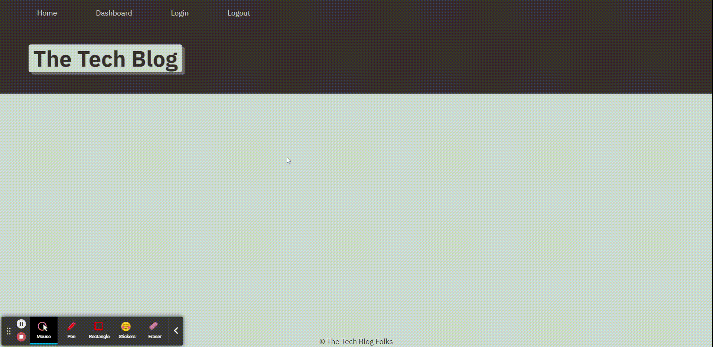

# Tech Blog

## Description
CMS-style blog site similar to a Wordpress site, where developers can publish their blog posts and comment on other developers’ posts. This application follows the MVC paradigm in its architectural structure, using Handlebars.js as the templating language, Sequelize as the ORM, and the express-session npm package for authentication.

### Links
* Github Repository: https://github.com/ejpascualj/Tech-Blog
* Deployed Application: https://tech-blog-ejpascualj.herokuapp.com/

## Walkthrough Demo

## Installation and Deployment
To install the necessary packages, open the terminal and run `npm install`. To deploy application locally, run `npm start` on the terminal.

## Development & Features
The technologies used for this development include: 
- express-handlebars
- MySQL2, Sequelize
- dotenv
- bcrypt
- express-session
- connect-session-sequelize 

## License

This project is licensed under MIT license.